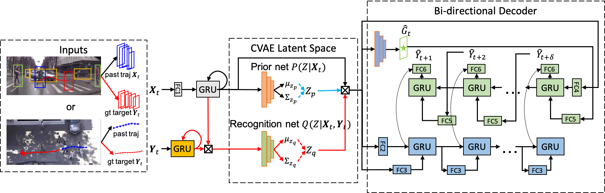
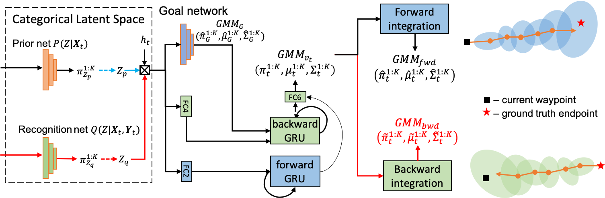

# BiTraP: Bi-directional Pedestrian Trajectory Prediction with Multi-modal Goal Estimation
Yu Yao, Ella Atkins, Matthew Johnson-Roberson, Ram Vasudevan and Xiaoxiao Du

This repo contains the code for our paper:[BiTraP: Bi-directional Pedestrian Trajectory Prediction with Multi-modal Goal Estimation](https://arxiv.org/abs/2007.14558).

Our BiTraP-NP network architecture:



Our BiTraP-GMM decoder architecture:



## Installation
### Dependencies
Our code was implemented using python and pytorch and tested on a desktop computer with Intel Xeon 2.10GHz CPU, NVIDIA TITAN X GPU and 128 GB memory.

* NVIDIA driver >= 418
* Python >= 3.6
* pytorch == 1.4.1 with GPU support (CUDA 10.1 & cuDNN 7)

Run following command to add bitrap path to the PYTHONPATH

  cd bidireaction-trajectory-prediction
  export PYTHONPATH=$PWD:PYTHONPATH

One can also use docker with `docker/Dockerfile`. 

## Training
Users can train the BiTraP models on JAAD, PIE or ETH-UCY dataset easily by runing the following command:
```
python tools/train.py --config_file **DIR_TO_THE_YML_FILE** 
```
To train on [JAAD](http://data.nvision2.eecs.yorku.ca/JAAD_dataset/) or [PIE](http://data.nvision2.eecs.yorku.ca/PIE_dataset/) dataset, the users need to download the dataset from their original webpage and follow their directions to extract pedestrian trajectory files ('.pkl'). The trajectories should locate at the `DATASET.TRAJECTORY_PATH` in the configuration file.

To train on ETH-UCY dataset, the users can download the trajectory files ('.pkl') from the [Trajectron++](https://github.com/StanfordASL/Trajectron-plus-plus) repo and put them at the `DATASET.TRAJECTORY_PATH` in the configuration file.

To train/inferece on CPU or GPU, simply add `DEVICE='cpu'` or  `DEVICE='cuda'`. By default we use GPU for both training and inferencing.

## Inference 
The checkpoints of our models trained on JAAD, PIE and ETH-UCY can be downloaded [here](https://drive.google.com/drive/folders/1MF-E6Td2BRizNrvIFcfsOl0LV2_BDQXB?usp=sharing).

### Bounding box trajectory prediction on JAAD and PIE
We predict the bounding box coordinate trajectory for first-person (ego-centric) view JAAD and PIE datasets.
Test on PIE dataset:
```
python tools/test.py --config_file configs/bitrap_np_PIE.yml CKPT_DIR **DIR_TO_CKPT**
### python test.py --config_file configs/bitrap_np_PIE.yml CKPT_DIR PIE/bitrap_np_K_20.pth

# batch size can be changed on datasets init make dataloader ....for eval check trainier.py in engine
python tools/test.py --config_file configs/bitrap_gmm_PIE.yml CKPT_DIR **DIR_TO_CKPT**
```

Test on JAAD dataset:
```
python tools/test.py --config_file configs/bitrap_np_JAAD.yml CKPT_DIR **DIR_TO_CKPT**
python tools/test.py --config_file configs/bitrap_gmm_JAAD.yml CKPT_DIR **DIR_TO_CKPT**
```
### Point trajectory prediction on ETH-UCY
We predict the point coordinate trajectory for bird's-eye view ETH-UCY datasets.
```
python tools/test.py --config_file configs/bitrap_np_ETH.yml DATASET.NAME **NAME_OF_DATASET** CKPT_DIR **DIR_TO_CKPT**
python tools/test.py --config_file configs/bitrap_gmm_ETH.yml DATASET.NAME **NAME_OF_DATASET** CKPT_DIR **DIR_TO_CKPT**
```

### env 
conda activate BiTraP_env
## Citation

If you found the repo is useful, please feel free to cite our papers:
```
@article{yao2020bitrap,
  title={BiTraP: Bi-directional Pedestrian Trajectory Prediction with Multi-modal Goal Estimation},
  author={Yao, Yu and Atkins, Ella and Johnson-Roberson, Matthew and Vasudevan, Ram and Du, Xiaoxiao},
  journal={arXiv preprint arXiv:2007.14558},
  year={2020}
}
```


<!-- # ETH in use: python test.py --config_file configs/bitrap_np_ETH.yml  CKPT_DIR ETH/bitrap_np_eth.pth -->

# hyperparams['minimum_history_length'] = cfg.MODEL.MIN_HIST_LEN #1 # different from trajectron++, we don't use short histories.
hyperparams['state'] = {'PEDESTRIAN':{'position':['x','y'], 'velocity':['x','y'], 'acceleration':['x','y']}}
hyperparams['pred_state'] = {'PEDESTRIAN':{'position':['x','y']}}


# The Eth dataset is manipulated before it is used as input
-> First  each x and y -> x=x-x.mean() and y=y-y.mean()
-> later 4 more variables are added vx vy ax and ay represneting the velocity and accelaration
-> vx = (x(i+1)-x(i) )/ dt  they take dt to be 0.4 similarly
-> ax = (v(i+1)-v(i) )/ dt   this is calculated if acc is not supplied as input 

# point based trajectory : input length is 8 datapoints with  6 parameters each {'position':['x','y'], 'velocity':['x','y'], 'acceleration':['x','y']} ..format [xp,yp,xv,yv,xa,ya] p-position , v-velocity and a-acceleration 
